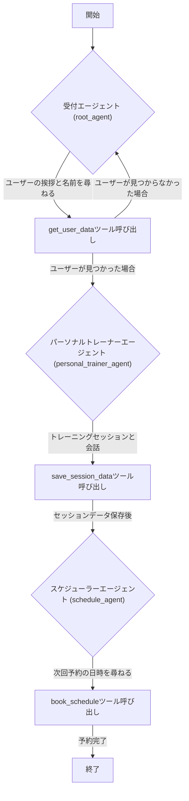

# personal-trainer-sample

GoogleのAgent Development Kit (ADK) で構築されたベースReActエージェント
[`googleCloudPlatform/agent-starter-pack`](https://github.com/GoogleCloudPlatform/agent-starter-pack) バージョン `0.26.2` で生成されたエージェント

## プロジェクト構成

このプロジェクトは以下のように構成されています：

```
personal-trainer-sample/
├── app/                 # コアアプリケーションコード
│   ├── __init__.py
│   ├── agent_engine_app.py # Agent Engine アプリケーションロジック
│   ├── agent.py         # メインエージェントロジック
│   ├── tools.py         # カスタムツールと機能
│   └── app_utils/       # アプリユーティリティとヘルパー
│       ├── deploy.py
│       ├── telemetry.py
│       └── typing.py
├── .cloudbuild/         # Google Cloud Build 用の CI/CD パイプライン設定
├── deployment/          # インフラストラクチャとデプロイメントスクリプト
├── notebooks/           # プロトタイピングと評価用の Jupyter notebook
├── tests/               # 単体テスト、統合テスト、負荷テスト
├── Makefile             # 共通コマンド用の Makefile
├── GEMINI.md            # AI 支援開発ガイド
└── pyproject.toml       # プロジェクトの依存関係と設定
```

> 💡 **ヒント:** AI 支援開発には [Gemini CLI](https://github.com/google-gemini/gemini-cli) を使用してください。プロジェクトのコンテキストは `GEMINI.md` に事前設定されています。

## 要件

開始する前に、以下があることを確認してください：
- **uv**: Python パッケージマネージャー (このプロジェクトのすべての依存関係管理に使用) - [インストール](https://docs.astral.sh/uv/getting-started/installation/) (`uv add <package>` で [パッケージを追加](https://docs.astral.sh/uv/concepts/dependencies/))
- **Google Cloud SDK**: GCP サービス用 - [インストール](https://cloud.google.com/sdk/docs/install)
- **Terraform**: インフラストラクチャのデプロイ用 - [インストール](https://developer.hashicorp.com/terraform/downloads)
- **make**: ビルド自動化ツール - [インストール](https://www.gnu.org/software/make/) (ほとんどの Unix ベースのシステムにプリインストールされています)


## クイックスタート (ローカルテスト)

必要なパッケージをインストールし、ローカル開発環境を起動します：

```bash
make install && make playground
```
> **📊 オブザーバビリティに関する注意:** エージェントテレメトリ (Cloud Trace) は常に有効です。プロンプトとレスポンスのログ記録 (GCS, BigQuery, Cloud Logging) は、ローカルでは **無効** ですが、デプロイされた環境では **デフォルトで有効** です (メタデータのみ - プロンプト/レスポンスなし)。詳細は [モニタリングとオブザーバビリティ](#モニタリングとオブザーバビリティ) を参照してください。

## コマンド

| コマンド | 説明 |
| --- | --- |
| `make install` | uv を使用して必要なすべての依存関係をインストールします |
| `make playground` | エージェントをテストするためのローカル開発環境を起動します |
| `make deploy` | エージェントを Agent Engine にデプロイします |
| `make register-gemini-enterprise` | デプロイされたエージェントを Gemini Enterprise に登録します ([ドキュメント](https://googlecloudplatform.github.io/agent-starter-pack/cli/register_gemini_enterprise.html)) |
| `make test` | 単体テストと統合テストを実行します |
| `make lint` | コード品質チェック (codespell, ruff, mypy) を実行します |
| `make setup-dev-env` | Terraform を使用して開発環境のリソースをセットアップします |

完全なコマンドオプションと使用法については、[Makefile](Makefile) を参照してください。


## 使用法

このテンプレートは「Bring Your Own Agent (エージェント持ち込み)」アプローチに従っています。あなたはビジネスロジックに集中し、テンプレートがそれ以外 (UI、インフラストラクチャ、デプロイメント、モニタリング) を処理します。
1. **プロトタイプ:** `notebooks/` にある入門ノートブックを参考にして、生成 AI エージェントを構築します。パフォーマンスを評価するには Vertex AI Evaluation を使用します。
2. **統合:** `app/agent.py` を編集して、エージェントをアプリにインポートします。
3. **テスト:** `make playground` でローカルプレイグラウンドを使用して、エージェントの機能を探索します。プレイグラウンドは、コードの変更時にエージェントを自動的にリロードします。
4. **デプロイ:** CI/CD パイプラインをセットアップして開始し、必要に応じてテストをカスタマイズします。包括的な手順については、[デプロイメントセクション](#デプロイメント) を参照してください。合理化されたインフラストラクチャのデプロイには、単に `uvx agent-starter-pack setup-cicd` を実行します。[`agent-starter-pack setup-cicd` CLI コマンド](https://googlecloudplatform.github.io/agent-starter-pack/cli/setup_cicd.html) を確認してください。現在、CI/CD ランナーとして Google Cloud Build と GitHub Actions の両方を使用した GitHub をサポートしています。
5. **モニター:** BigQuery のテレメトリデータ、Cloud Logging、Cloud Trace を使用してパフォーマンスを追跡し、洞察を収集して、アプリケーションを反復改善します。

プロジェクトには、テンプレートについて質問する際に Gemini CLI などの AI ツールにコンテキストを提供する `GEMINI.md` ファイルが含まれています。


## デプロイメント

> **注意:** Terraform を使用した CI/CD パイプライン全体とインフラストラクチャの合理化されたワンコマンドデプロイについては、[`agent-starter-pack setup-cicd` CLI コマンド](https://googlecloudplatform.github.io/agent-starter-pack/cli/setup_cicd.html) を使用できます。現在、CI/CD ランナーとして Google Cloud Build と GitHub Actions の両方を使用した GitHub をサポートしています。

### 開発環境

以下のコマンドを使用して、開発環境へのデプロイをテストできます：

```bash
gcloud config set project <your-dev-project-id>
make deploy
```


リポジトリには、開発用 Google Cloud プロジェクトのセットアップのための Terraform 設定が含まれています。
手順については [deployment/README.md](deployment/README.md) を参照してください。

### 本番環境へのデプロイ

リポジトリには、本番用 Google Cloud プロジェクトのセットアップのための Terraform 設定が含まれています。インフラストラクチャとアプリケーションをデプロイする方法の詳細な手順については、[deployment/README.md](deployment/README.md) を参照してください。

## モニタリングとオブザーバビリティ

アプリケーションは 2 つのレベルのオブザーバビリティを提供します：

**1. エージェントテレメトリイベント (常に有効)**
- OpenTelemetry のトレースとスパンが **Cloud Trace** にエクスポートされます
- エージェントの実行、レイテンシ、システムメトリクスを追跡します

**2. プロンプトとレスポンスのログ記録 (設定可能)**
- GenAI 計測機能が LLM のやり取り (トークン、モデル、タイミング) をキャプチャします
- **Google Cloud Storage** (JSONL)、**BigQuery** (外部テーブル)、**Cloud Logging** (専用バケット) にエクスポートされます

| 環境 | プロンプトとレスポンスのログ記録 |
|-------------|-------------------------|
| **ローカル開発** (`make playground`) | ❌ デフォルトで無効 |
| **デプロイされた環境** (Terraform 経由) | ✅ **デフォルトで有効** (プライバシー保護: メタデータのみ、プロンプト/レスポンスなし) |

**ローカルで有効にするには:** `LOGS_BUCKET_NAME` を設定し、`OTEL_INSTRUMENTATION_GENAI_CAPTURE_MESSAGE_CONTENT=NO_CONTENT` を設定します。

**デプロイメントで無効にするには:** Terraform 設定を編集して `OTEL_INSTRUMENTATION_GENAI_CAPTURE_MESSAGE_CONTENT=false` に設定します。

詳細な手順、クエリ例、視覚化オプションについては、[オブザーバビリティガイド](https://googlecloudplatform.github.io/agent-starter-pack/guide/observability.html) を参照してください。


## 構成イメージ

