# personal-trainer-sample

A base ReAct agent built with Google's Agent Development Kit (ADK)
Agent generated with [`googleCloudPlatform/agent-starter-pack`](https://github.com/GoogleCloudPlatform/agent-starter-pack) version `0.26.2`

## Project Structure

This project is organized as follows:

```
personal-trainer-sample/
├── app/                 # Core application code
│   ├── agent.py         # Main agent logic
│   ├── agent_engine_app.py # Agent Engine application logic
│   └── app_utils/       # App utilities and helpers
├── .cloudbuild/         # CI/CD pipeline configurations for Google Cloud Build
├── deployment/          # Infrastructure and deployment scripts
├── notebooks/           # Jupyter notebooks for prototyping and evaluation
├── tests/               # Unit, integration, and load tests
├── Makefile             # Makefile for common commands
├── GEMINI.md            # AI-assisted development guide
└── pyproject.toml       # Project dependencies and configuration
```

> 💡 **Tip:** Use [Gemini CLI](https://github.com/google-gemini/gemini-cli) for AI-assisted development - project context is pre-configured in `GEMINI.md`.

## Requirements

Before you begin, ensure you have:
- **uv**: Python package manager (used for all dependency management in this project) - [Install](https://docs.astral.sh/uv/getting-started/installation/) ([add packages](https://docs.astral.sh/uv/concepts/dependencies/) with `uv add <package>`)
- **Google Cloud SDK**: For GCP services - [Install](https://cloud.google.com/sdk/docs/install)
- **Terraform**: For infrastructure deployment - [Install](https://developer.hashicorp.com/terraform/downloads)
- **make**: Build automation tool - [Install](https://www.gnu.org/software/make/) (pre-installed on most Unix-based systems)


## Quick Start (Local Testing)

Install required packages and launch the local development environment:

```bash
make install && make playground
```
> **📊 Observability Note:** Agent telemetry (Cloud Trace) is always enabled. Prompt-response logging (GCS, BigQuery, Cloud Logging) is **disabled** locally, **enabled by default** in deployed environments (metadata only - no prompts/responses). See [Monitoring and Observability](#monitoring-and-observability) for details.

## Commands

| Command              | Description                                                                                 |
| -------------------- | ------------------------------------------------------------------------------------------- |
| `make install`       | Install all required dependencies using uv                                                  |
| `make playground`    | Launch local development environment for testing agent |
| `make deploy`        | Deploy agent to Agent Engine |
| `make register-gemini-enterprise` | Register deployed agent to Gemini Enterprise ([docs](https://googlecloudplatform.github.io/agent-starter-pack/cli/register_gemini_enterprise.html)) |
| `make test`          | Run unit and integration tests                                                              |
| `make lint`          | Run code quality checks (codespell, ruff, mypy)                                             |
| `make setup-dev-env` | Set up development environment resources using Terraform                         |

For full command options and usage, refer to the [Makefile](Makefile).


## Usage

This template follows a "bring your own agent" approach - you focus on your business logic, and the template handles everything else (UI, infrastructure, deployment, monitoring).
1. **Prototype:** Build your Generative AI Agent using the intro notebooks in `notebooks/` for guidance. Use Vertex AI Evaluation to assess performance.
2. **Integrate:** Import your agent into the app by editing `app/agent.py`.
3. **Test:** Explore your agent functionality using the local playground with `make playground`. The playground automatically reloads your agent on code changes.
4. **Deploy:** Set up and initiate the CI/CD pipelines, customizing tests as necessary. Refer to the [deployment section](#deployment) for comprehensive instructions. For streamlined infrastructure deployment, simply run `uvx agent-starter-pack setup-cicd`. Check out the [`agent-starter-pack setup-cicd` CLI command](https://googlecloudplatform.github.io/agent-starter-pack/cli/setup_cicd.html). Currently supports GitHub with both Google Cloud Build and GitHub Actions as CI/CD runners.
5. **Monitor:** Track performance and gather insights using BigQuery telemetry data, Cloud Logging, and Cloud Trace to iterate on your application.

The project includes a `GEMINI.md` file that provides context for AI tools like Gemini CLI when asking questions about your template.


## Deployment

> **Note:** For a streamlined one-command deployment of the entire CI/CD pipeline and infrastructure using Terraform, you can use the [`agent-starter-pack setup-cicd` CLI command](https://googlecloudplatform.github.io/agent-starter-pack/cli/setup_cicd.html). Currently supports GitHub with both Google Cloud Build and GitHub Actions as CI/CD runners.

### Dev Environment

You can test deployment towards a Dev Environment using the following command:

```bash
gcloud config set project <your-dev-project-id>
make deploy
```


The repository includes a Terraform configuration for the setup of the Dev Google Cloud project.
See [deployment/README.md](deployment/README.md) for instructions.

### Production Deployment

The repository includes a Terraform configuration for the setup of a production Google Cloud project. Refer to [deployment/README.md](deployment/README.md) for detailed instructions on how to deploy the infrastructure and application.

## Monitoring and Observability

The application provides two levels of observability:

**1. Agent Telemetry Events (Always Enabled)**
- OpenTelemetry traces and spans exported to **Cloud Trace**
- Tracks agent execution, latency, and system metrics

**2. Prompt-Response Logging (Configurable)**
- GenAI instrumentation captures LLM interactions (tokens, model, timing)
- Exported to **Google Cloud Storage** (JSONL), **BigQuery** (external tables), and **Cloud Logging** (dedicated bucket)

| Environment | Prompt-Response Logging |
|-------------|-------------------------|
| **Local Development** (`make playground`) | ❌ Disabled by default |
| **Deployed Environments** (via Terraform) | ✅ **Enabled by default** (privacy-preserving: metadata only, no prompts/responses) |

**To enable locally:** Set `LOGS_BUCKET_NAME` and `OTEL_INSTRUMENTATION_GENAI_CAPTURE_MESSAGE_CONTENT=NO_CONTENT`.

**To disable in deployments:** Edit Terraform config to set `OTEL_INSTRUMENTATION_GENAI_CAPTURE_MESSAGE_CONTENT=false`.

See the [observability guide](https://googlecloudplatform.github.io/agent-starter-pack/guide/observability.html) for detailed instructions, example queries, and visualization options.


## 構成イメージ

```mermaid
graph TD
    A[開始] --> B{"受付エージェント (root_agent)"};

    B -- ユーザーの挨拶と名前を尋ねる --> C[get_user_dataツール呼び出し];

    C -- ユーザーが見つかった場合 --> D{"パーソナルトレーナーエージェント (personal_trainer_agent)"};
    C -- ユーザーが見つからなかった場合 --> B;

    D -- トレーニングセッションと会話 --> E[save_session_dataツール呼び出し];

    E -- セッションデータ保存後 --> F{"スケジューラーエージェント (schedule_agent)"};

    F -- 次回予約の日時を尋ねる --> G[book_scheduleツール呼び出し];

    G -- 予約完了 --> H[終了];
```

